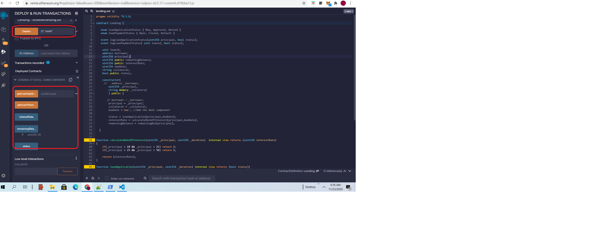

# LeafCelo
## An asset-backed defi lending platform for refugee

- Architecture
	- 
- Implementation
	- Smart Contract
	    - constructor()
			- uint256 _principal,
        	- string memory _collateral,
			- status = loanApplication(principal,dueDate);
        	- interestRate = calculateRateOfInterest(principal,dueDate);
        	- remainingBalance = remainingBal(principal);		      
        - calculateRateOfInterest(uint256 _principal, uint256 _duration)  internal view returns (uint256 interestRate)
  		- loanApplication(uint256 _principal, uint256 _duration) internal view returns (bool status)
		- remainingBal(uint256 _principal) internal view returns (uint256 _remainingBal)
		- getLoanApplicationStatus(uint loanid) public returns(bool status)
		- getLoanPaymentStatus() public  returns(bool status)		
 	- Mobile Wallet	
- Build
Goal of this build is to build the apk for the android
	- npm i
    - npm start
    - npm run android(second terminial) 
	
- Testing
	- UI side testing
		- Download the apk
		- pass user details. (Test user details -> user name : user2, pin:1234)
	- Test Smart contract
		- Remix (quick way)
		- after the smart contract is deployed pass the parameters in the constructor : 27, "Smith"
		- 
## Fund account
- Users can use this link to fund their account https://celo.org/developers/faucet
## Test Explorer
- https://alfajores-blockscout.celo-testnet.org/

## Deploying
This is deployed to alfajores-forno
- cd to root
- node helloCello.js
- truffle compile
- truffle migrate --network alfajores

- roadmap
	- P2P lending
- Announcements
	- [The 18 finalists of Celo Camp Batch 2](https://medium.com/celoorg/the-18-finalists-in-celo-camp-batch-2-the-up-and-coming-startups-bringing-financial-inclusion-to-845b67e960c8)
- FAQS
- Mockup-UI
- Signin/signup
	- 
- Apply for loan
	- 	
- Submit
	- 	
- Result
	- 	
