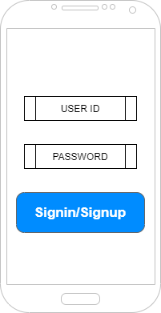
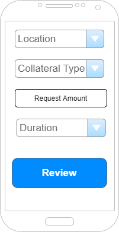
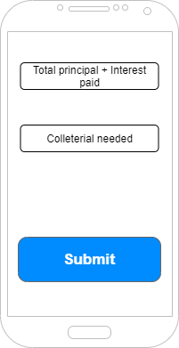

# LeafCelo
## An asset-backed defi lending platform for refugee

- Architecture
- Implementation
	- Dependencies 
		- [openzeppelin-solidity](https://openzeppelin.com/contracts/)
	- Smart Contract
	    - constructor()
		  - address payable leafToken
		  - address refugee
		  - address lender,          
          - uint256 valueRequested,
		  - uint256 valueRequestedDuration
		  - string collateralDetails;     
        - creatingToken()
  		- addRequester()
		- addLender()
		- requestToken()
		- calculateInterests()
		- watchDuration()
		- requestWithdraw()
		- requestCancel()    		
		- issuingRewards()  
		- burnTokens()
		- requestCollateral()
		- releaseCollateral()
 	- Mobile Wallet	
- Build
- Testing
- roadmap
	- P2P lending
- Announcements
	- [The 18 finalists of Celo Camp Batch 2](https://medium.com/celoorg/the-18-finalists-in-celo-camp-batch-2-the-up-and-coming-startups-bringing-financial-inclusion-to-845b67e960c8)
- FAQS
- Mockup-UI
- Signin/signup
	- 
- Apply for loan
	- 	
- Submit
	- 	
- Result
	- 	